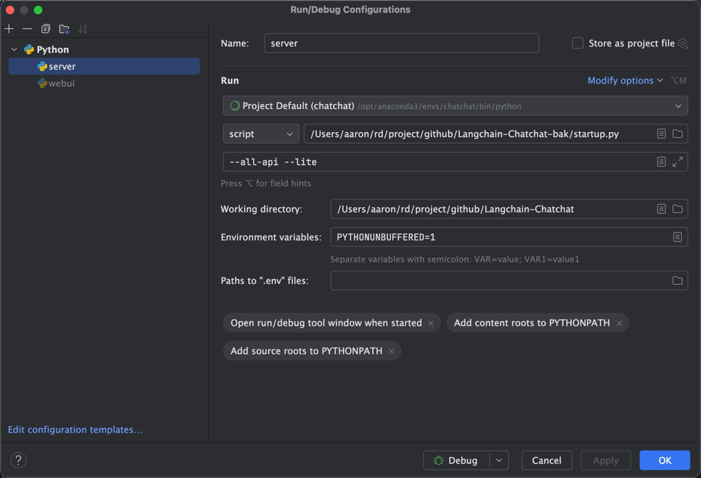
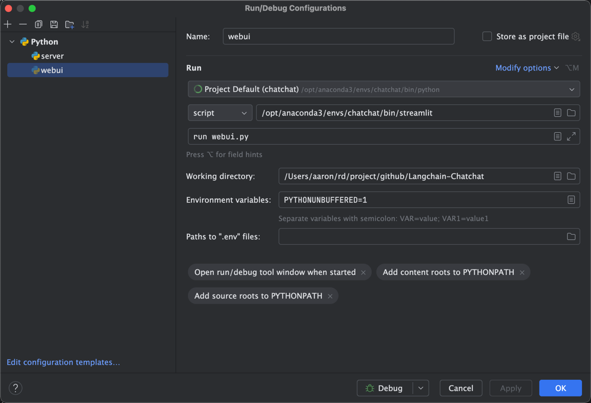

1. 执行 git clone git@github.com:deeptest-com/Langchain-Chatchat.git 克隆代码；

2. 安装依赖（以下使用远程大模型）
```
   pip install -r requirements_lite.txt
   pip install -r requirements_webui.txt  
```

3. 执行 python copy_config_example.py 初始化配置文件；


4. 修改configs/model_config.py文件：
   
   第8行`选用的 Embedding 名称`后，至`EMBEDDING_DEVICE = "auto"`前，加入：
   ```
    # 选用的 Embedding 名称
    # EMBEDDING_MODEL = "bge-large-zh-v1.5"
    EMBEDDING_MODEL = "text-embedding-ada-002"

    # 是否embedding使用openai like的api接口
    EMBEDDING_MODEL_USE_OPENAI = True

    # 这里tiktoken设置为false，并设置tiktoken model name为本地的hungginface的路径，可以使用指定的模型的tokenizer来切分。
    # 如果想使用openai tiktoken，则设置tiktoken enable为True。

    # chunk_size 设置单词请求的最大batch
    # embedding_ctx_length 设置单个batch的token的最大长度，需要小于等于模型限制的最大值
    EMBEDDING_MODEL_OPENAI = {
        "model_name": "text-embedding-ada-002",
        "api_base_url": "https://api.openai-proxy.org/v1",
        "api_key": "sk-Gl1V3nAzyE3m8wAiEEx6ijlcoux3Vx5lP4ZVj5v0tmaJYKhe",
        "openai_proxy": "",
        "tiktoken_enabled": False,
        "tiktoken_model_name": "text-embedding-ada-002",
        "chunk_size": 20,
        "embedding_ctx_length": 256,
    }
   ```
   在ONLINE_LLM_MODEL对象中，注释掉原来的"openai-api"配置项，加入新的：
   ```
    # CloseAI OpenAI Proxy
    "openai-api": {
        "model_name": "gpt-4",
        "api_base_url": "https://api.openai-proxy.org/v1",
        "api_key": "sk-Gl1V3nAzyE3m8wAiEEx6ijlcoux3Vx5lP4ZVj5v0tmaJYKhe",
        "openai_proxy": "",
    },
   ```
   
5. 执行 python init_database.py --recreate-vs ；


6. 执行 pip install streamlit 安装streamlit；


7. 按如下配置启动Server；



8. 按如下配置启动WebUI；



9. 用浏览器打开起始页http://localhost:8501
